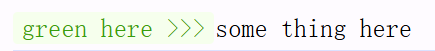
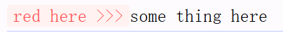
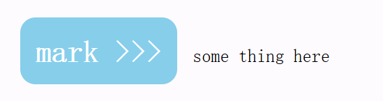
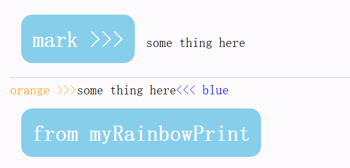

> Translate powered by ChatGpt

# Rainbow🌈Print

[中文]([./](https://github.com/Licheung228/rainbow-print/blob/main/docs/cn.md)) | [English](./)

🌈 rainbow console.log⌨️

Enhanced `console.log`

## Features

`rainbowPrint` consists of two components: **Printer** and **Styler**.

Both components are encapsulated within `rainbowPrint`.

### Overview

**Printer**

`rainbowPrint.log` is the enhanced version of `console.log`.

**Styler**

`rainbowPrint[styleName]` is used for styling, and `rainbowPrint` natively provides some styles. You can also extend styles via `rainbowPrint.addStyle` and `rainbowPrint.addStyles`.

### console.color

You can globally register `rainbowPrint` to `console.color` in your project's entry file for more convenient usage. `rainbowPrint` also provides good TypeScript type declaration support. [See more](#consolecolor-1)

## Usage

**Basic Usage**

```js
import rainbowPrint from 'rainbow-print'

rainbowPrint.log(rainbowPrint.green('green here >>>'), 'some thing here')
```

Effect:


**Destructuring**

You can also destructure all functionalities:

```js
import rainbowPrint from 'rainbow-print'

const { red, log } = rainbowPrint
log(red('red here >>>'), 'some thing here')
```

Effect:


**Custom Styles**

If you want to create your own styles, you can use `addStyles` or `addStyle` to achieve this:

```js
import rainbowPrint from 'rainbow-print'

// Custom Style
const myRainbowPrint = rainbowPrint.addStyle('skyblue', {
  color: '#fff',
  'background-color': 'skyblue',
  'font-size': '20px',
  'font-weight': 'bold',
  'border-radius': '10px',
  padding: '10px',
  margin: '10px',
})
log(myRainbowPrint.skyblue('mark >>>'), 'some thing here')
```

Effect:


## TypeScript Support

`rainbowPrint` is written in TypeScript and has good code hinting. The styles you add will be suggested.

**When you add new styles to any instance, they will inherit the previous styles.**

```ts
import rainbowPrint from 'rainbow-print'

// Custom Style
const myRainbowPrint = rainbowPrint.addStyle('skyblue', {
  color: '#fff',
  'background-color': 'skyblue',
  'font-size': '20px',
  'font-weight': 'bold',
  'border-radius': '10px',
  padding: '10px',
  margin: '10px',
})
log(myRainbowPrint.skyblue('mark >>>'), 'some thing here')

// Add multiple styles
const myRainbowPrint2 = myRainbowPrint.addStyles({
  orange: {
    color: 'orange',
  },
  blue: {
    color: 'blue',
  },
})
log(
  myRainbowPrint2.orange('orange >>>'),
  'some thing here',
  myRainbowPrint2.blue('<<< blue'),
  myRainbowPrint2.skyblue('from myRainbowPrint'), // Inherits previous styles
)
```

Effect:


# console.color

You can globally register `rainbowPrint` to `console.color` in your project's entry file for more convenient usage. `rainbowPrint` also provides good TypeScript type declaration support.

```ts
import rainbowPrint from 'rainbow-print'

console.color = rainbowPrint.log
```

## Type Declarations

Create a new type declaration file (make sure it's included in your `tsconfig`) and import `rainbow-print/color` in the type declaration file, for example:

**global.d.ts**

```ts
/// <reference types="rainbow-print/color" />
```
